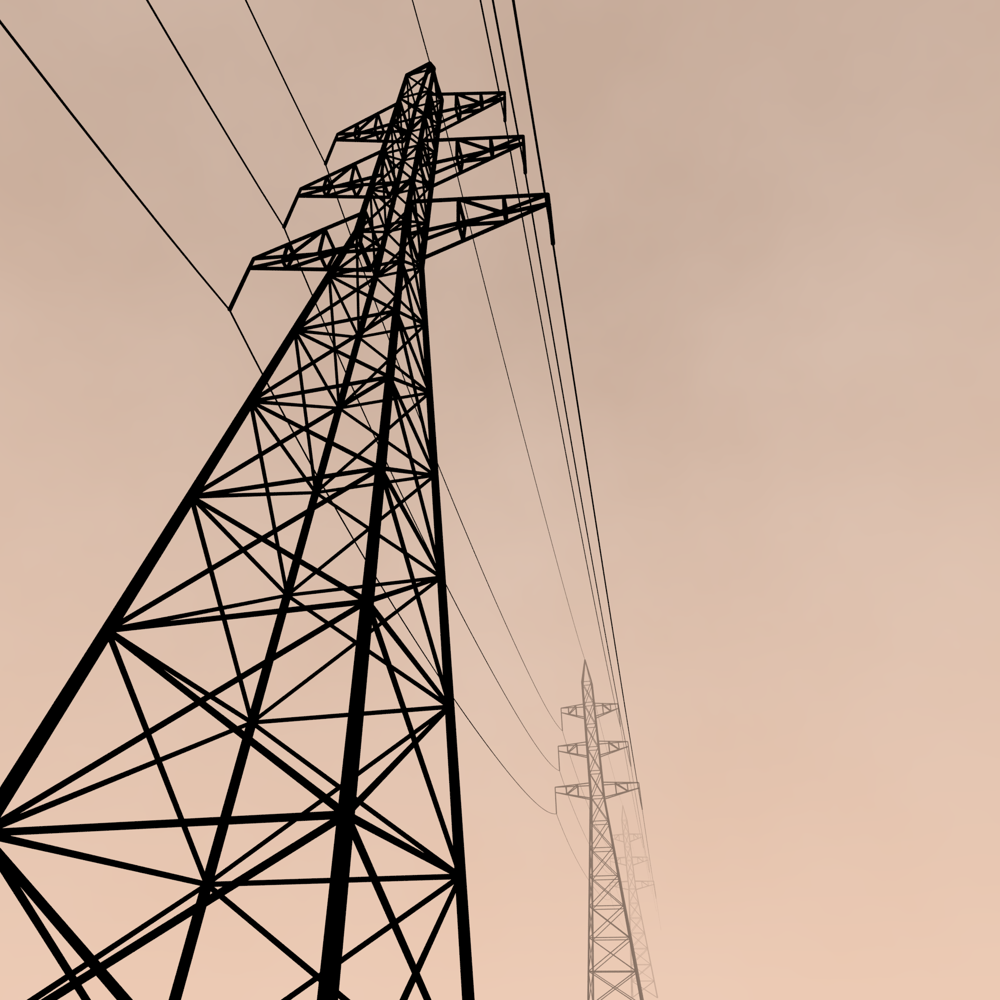
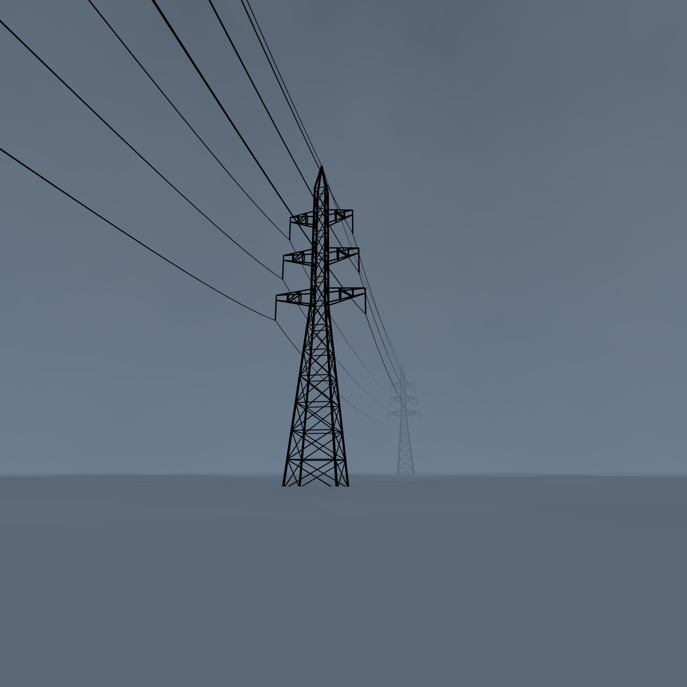
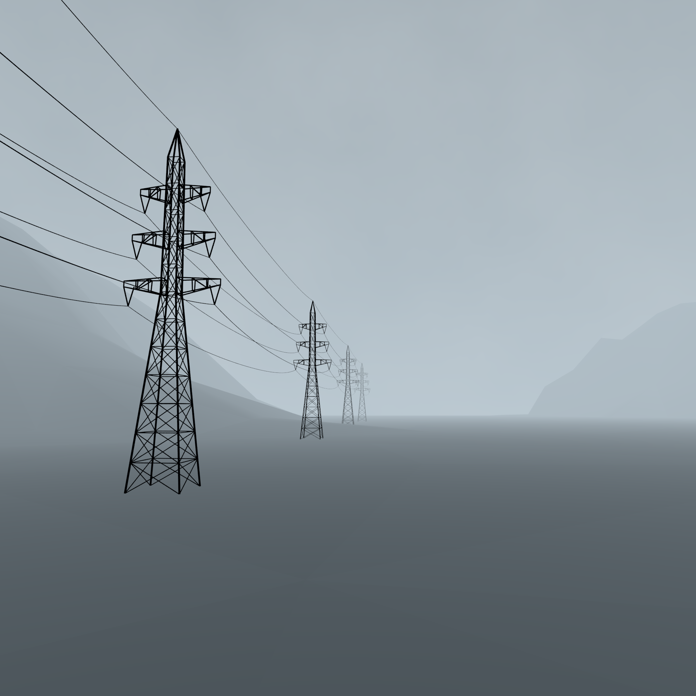
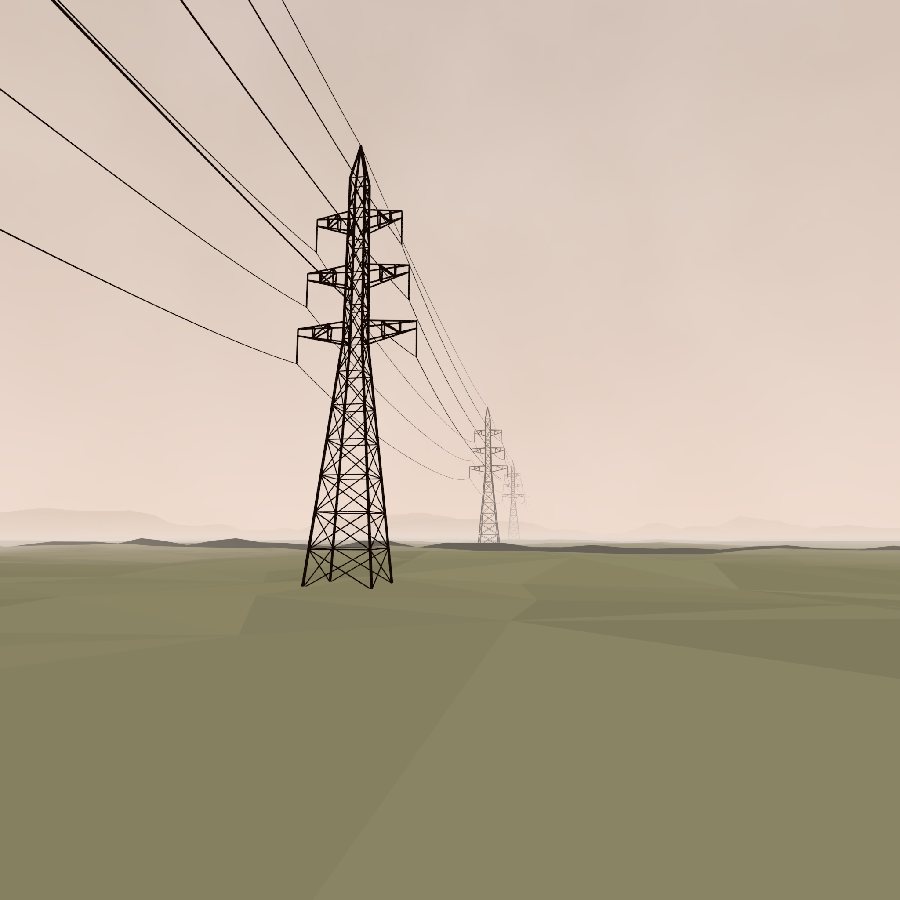
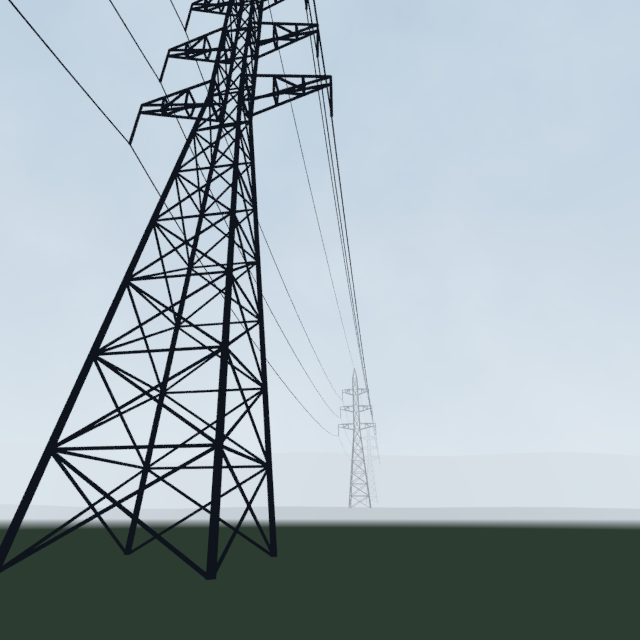

# objects

A series of images built from nothing but rules. This is the third phase, following
2016 (#0–8) and 2017 (#9–23); numbering restarts at 0.

A picture here depicts no situation — there are only rules. The rules are formalized
as version-controlled prompts, a language model samples within them, deterministic
validators reject what breaks them, and human judgment of the results feeds back into
the next revision of the rules. **The prompts are the published artifact** — the
procedure is meant to be runnable by anyone.

The current series is **pylon-series**: a line of lattice transmission towers in fog.
One piece a day goes out at [instagram.com/pylonscape](https://instagram.com/pylonscape)
— a scheduled action reads the account's own feed to find what has not been posted
yet, and falls silent when the series has caught up with itself.

| bare sky | snowfield | mountains | farmland |
|---|---|---|---|
|  |  |  |  |

## The division of labor

**Fixed by code** (`scripts/pylon3d.py`): the towers themselves. Real suspension-tower
proportions — 45 m body, square lattice with X-braced panels, volumetric arm trusses,
insulator strings, conductors hanging as true catenaries. Every member renders as a
continuous beveled line. A wire cannot float: its endpoints are computed from the arms
it hangs from, so placement has stakes because the object is real. The line has no
ends — the conductors continue past both terminal towers, so what closes the picture
is the frame and the fog, never the geometry running out.

**Decided by the model, within the rules** (`rulesets/pylon-series/rules.md`): the
camera, the rhythm of the line (tower count, spans, tower scale, insulator style), the
sky and fog, the palette, and an optional landscape.

**The world is emission-only** — there are no lights. Fog, ground mist, and terrain
shading are all material arithmetic, so a palette color renders as exactly that color.
The land, when present, is deliberately unreal: a low-poly faceted heightfield, each
flat-shaded triangle taking a single tone.

## The procedure

```
rulesets/pylon-series/rules.md          the prompt — the thing being published
rulesets/pylon-series/directions.json   per-piece briefs: assigned pieces keep
        │                               theirs forever; new pieces are points in a
        │                               declared design space (stage × mood ×
        │                               density × composition × line), the mood
        │                               axis bounding each piece's palette anchor
        ▼
sample_pylons.py                        claude -p, headless; one piece per brief
        │        ◄──────────────┐
        ▼                       │ violations (retried in-session,
validate_pylon.py               │  rejects kept with reasons)
  pure python: projects the     │
  tower through the camera,     │
  walks the same terrain        │
  functions the renderer uses,  │
  checks fog and ΔE contrast ───┘
        │ pass
        ▼
scenes/pylon-series/NNN.json            the unit of reproduction
        │
        ▼
render_pylon3d.py (Blender, Cycles)     spec -> image, deterministically
        │
        ▼
human judgment ──► rulesets/pylon-series/judgments/   ──► the next revision
  (per batch — on the rules,                               of rules.md
   never on the piece)
```

That third arrow points at the rules, not at the pictures. **Every spec the validator
accepts is part of the series and goes out in its turn** — there is no second gate
where taste picks winners, because a hand-picked series would make the rules a
suggestion. When a piece disappoints, the thing that was wrong is the rules, and the
judgment says so; the piece itself stays, including the ones a later revision would
no longer produce. Selection happens once, in code, against thresholds anyone can
read.

### The two loops

The procedure above is the **main loop**; its unit is the **batch** — a sampled
group of pieces judged together, each verdict feeding the next revision of the
rules. Piece numbers are permanent; batches are judgment events.

Beside it runs a **scout loop**: evolution campaigns (`scripts/evolve_colors.py`,
`scenes/evolve/`). A campaign explores one question — the first, `color-01`, asked
what the palette space holds — by evolving spec genomes on frozen compositions,
MAP-Elites-style: **generations** of mutate → validate → render → judge, a vision
model scoring the drafts and the author's own 1–10 scores overriding it, the best
individual kept per niche so the result is a map of the territory, not a single
winner. Campaign individuals never become pieces. What a campaign finds is
**distilled** into the next rules revision — `color-01` became four dusk mood
bands and a relaxed gradient gate — so the published artifact stays the rules.

The two loops keep separate clocks, and deliberately so. A batch is due when the
posting queue runs shallow — demand decides that, and `post_instagram.py --check`
reports the depth. A campaign is due when there is a question the rules cannot
answer; a campaign without one burns renders to learn nothing. Tying either to the
other's count would put an exploratory activity on the critical path of a daily
commitment. **One ordering does bind them: a campaign's findings are distilled into
the rules before the next batch is sampled, never after.** Piece numbers are
permanent, so a batch drawn from a map that was already out of date cannot be taken
back — it just becomes part of the series.

**The refusals are part of the record.** Rejected candidates are kept in
`scenes/pylon-series/rejected/` with the violations that killed them, and whole
directions the author rejected stay in the history. The flat cutout terrain below was
judged as adding close to nothing — the critique that led to the low-poly landscape:

| rejected direction | where it ended up |
|---|---|
|  |  |

## Reproducibility

- **Deterministic**: `scenes/*.json` → image. Rendering is a pure function of the
  spec — no lights, no denoiser, no randomness anywhere in the geometry (terrain is
  sine-sum heightfields; even the low-poly jitter is a sine hash). Every generative
  rule is a deterministic function.
- **Non-deterministic**: prompt → JSON. LLM sampling does not reproduce; instead each
  spec's `meta` records the model and a content hash of the exact rules revision
  (`rules_sha`) that produced it.

Whether a given composition can be sampled again is not guaranteed. Whether a given
image can be made again is — provided you also know which renderer made it. A spec
names the picture; the renderer decides the file. So `docs/pieces.md` records a content
hash of `pylon3d.py` and `render_pylon3d.py` beside the pieces, the render driver
stamps the same hash into the output directory it writes, and `report_pylons.py
--check` refuses to regenerate the manifest when the two have drifted apart. The series
has already lived through one renderer revision that changed every image while every
spec stayed byte-identical; nothing recorded it at the time.

Because of that, the series is its own regression test. `validate_pylon.py` run on its
own replays every spec in `scenes/`: the pieces must still pass the rules that admitted
them, and the candidates in `rejected/` must still be refused. A revision that quietly
invalidates work already in the series says so immediately, and one that would have
admitted a rejected candidate has to be named as such.

## Layout

```
rulesets/pylon-series/
  rules.md         the prompt, sent verbatim — nothing else is
  directions.json  per-piece creative briefs and the design space behind new pieces
  checks.json      validation thresholds, layered over defaults
  notes.md         for humans: where each rule came from
  judgments/       the author's per-batch verdicts — the loop's third arrow
scenes/          specs, the units of reproduction (rejected/ and superseded/ included)
scenes/evolve/   evolution campaigns — the scout loop's genomes, scores, and niche maps
scripts/         sampling, validation, rendering — python stdlib only
outputs/         rendered images (reproducible, not tracked)
docs/pieces.md   generated manifest: what every piece number is
docs/images/     curated copies for this page
```

Four of those are worth opening on their own. [**rules.md**](rulesets/pylon-series/rules.md)
is the prompt itself — the published artifact, and the shortest way to see what the
model is actually asked. [**notes.md**](rulesets/pylon-series/notes.md) is where every
threshold came from, revision by revision, and is the closest thing to a history of the
series. [**judgments/**](rulesets/pylon-series/judgments/) holds the per-batch verdicts
(and [what a verdict means](rulesets/pylon-series/judgments/_format.md), which is not
what it usually means elsewhere). [**pieces.md**](docs/pieces.md) is the generated
manifest: every piece number, its brief, its palette anchor, and the exact revision of
the rules that made it. A [second rule set](rulesets/README.md) would start by copying
a directory, not by editing Python.

## Setup and running

Python 3.11+ (stdlib only), Blender 4.x+, and the claude CLI (logged in — no API key).

```sh
# sample pieces (direction is fixed per piece number; rejects are kept)
python scripts/sample_pylons.py --only 24,25,26,27

# render drafts / full resolution (set BLENDER, or have blender on PATH)
python scripts/render_pylons.py --pieces 24-27
python scripts/render_pylons.py --pieces 26 --full

# render the hand-authored demo scenes
python scripts/render_pylons.py --demos

# regenerate the manifest (docs/pieces.md) and a local contact sheet
python scripts/report_pylons.py

# self-checks: replay the whole spec corpus; confirm the manifest is not stale
python scripts/validate_pylon.py
python scripts/report_pylons.py --check

# package post-ready images + captions (outputs/pylon-series/instagram/)
python scripts/export_instagram.py

# publishing: host new JPEGs, then post (a scheduled action does this daily)
python scripts/post_instagram.py --upload
python scripts/post_instagram.py --check

# scout loop: seed a campaign, breed one generation, write the niche-map report
python scripts/evolve_colors.py --init
python scripts/evolve_colors.py --gen
python scripts/evolve_colors.py --report
```

## License

Split: code (scripts, rulesets, specs) is MIT (`LICENSE`); images — `docs/images/`,
`docs/thumbs/`, and any render produced from the specs — are CC BY-NC 4.0
(`LICENSE-IMAGES`).
